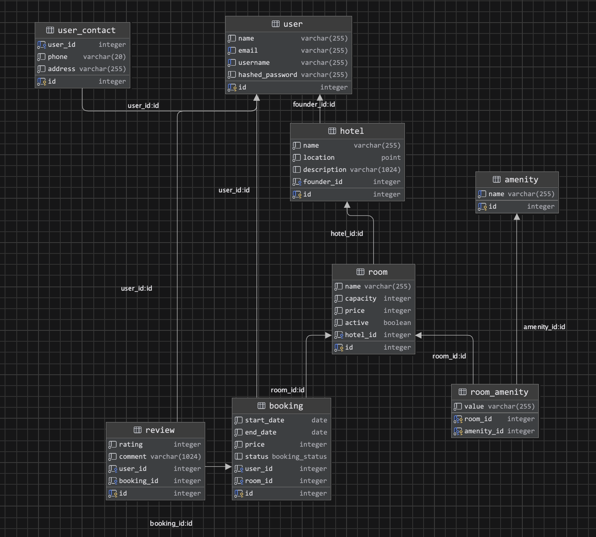

Проектирование схемы БД для https://booking.com

## Описание

Система позволяет пользователям бронировать номера в отелях.

Пользователь выбирает конкретные даты и местоположение, и система показывает доступные отели с
номерами и их ценами. Каждый номер имеет набор удобств.

После поездки пользователь может оставить отзыв об отеле, который влияет на общий рейтинг отеля среди пользователей.

> Такая система может иметь больший функционал, но этого достаточно для основного кейса.

## Сущности

| Сущность	     | Описание                                                                                                                         |
|---------------|----------------------------------------------------------------------------------------------------------------------------------|
| user          | 	Представляет собой пользователя системы бронирования отелей.                                                                    |
| user_contact	 | Содержит информацию о контактных данных пользователя.                                                                            |
| hotel	        | Основная единица системы, которая состоит из номеров.                                                                            |
| room	         | Представляет собой номер в отеле, доступный для бронирования.                                                                    |
| amenity	      | Представляет собой удобства номера, например, ТВ, Wi-Fi и др.                                                                    |
| booking       | 	Представляет процесс бронирования номера на определенные даты.                                                                  |
| review	       | После поездки пользователь может оставить отзыв о своем бронировании, который влияет на общий рейтинг отеля среди пользователей. |

## Дизайн

Все таблицы находятся в 3-ей нормальной форме (3NF) по следующим причинам:

- Все таблицы находятся в 1NF, потому что каждый атрибут содержит только атомарные значения.
- Все таблицы находятся во 2NF, потому что каждый непростой атрибут полностью функционально зависит от первичного ключа.
- Все таблицы находятся в 3NF, потому что каждый непростой атрибут не транзитивно зависит от первичного ключа.
